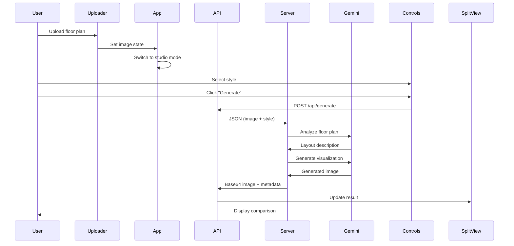

# MQT Project Structure

## Overview

MQT is a full-stack web application that transforms 2D architectural floor plans into photorealistic 3D visualizations using Google Gemini AI. The application features a React frontend with a Node.js Express backend - all in a single unified server.

```
Frontend (React + Vite) ←→ Backend (Express + Node.js) ←→ Google Gemini API
```

---

## Directory Structure

```
MQT/
├── src/                          # Frontend source code
│   ├── components/               # React components
│   │   ├── Controls.jsx          # Style selection panel
│   │   ├── Hero.jsx              # Landing page
│   │   ├── Layout.jsx            # App layout wrapper
│   │   ├── SplitView.jsx         # Image comparison slider
│   │   └── Uploader.jsx          # File upload interface
│   ├── services/
│   │   └── api.js                # API client for backend
│   ├── data/
│   │   └── style_prompts.json    # Architectural style presets (frontend)
│   ├── assets/                   # Static assets (images, icons)
│   ├── App.jsx                   # Root component
│   ├── main.jsx                  # App entry point
│   └── index.css                 # Global styles (Glassmorphism design system)
│
├── server/                       # Backend source code
│   ├── index.js                  # Express server (API + Vite integration)
│   ├── config.js                 # Configuration management
│   ├── gemini.js                 # Gemini API client and handlers
│   └── styles.js                 # Style preset definitions
│
├── public/                       # Static public assets
│   └── vite.svg                  # Favicon
│
├── dist/                         # Built frontend (production)
│
├── docs/                         # Project documentation
│   ├── PRD.md                    # Product Requirements Document
│   └── REMODEL_PLAN.md           # Architecture migration plan
│
├── archive/                      # Historical/deprecated files
│
├── package.json                  # Node.js dependencies and scripts
├── vite.config.js                # Vite build configuration
├── eslint.config.js              # ESLint configuration
├── Dockerfile                    # Container build instructions
├── .env.example                  # Environment variables template
├── .gitignore                    # Git ignore rules
├── README.md                     # Main documentation
├── DEPLOYMENT.md                 # Deployment instructions
├── PROJECT_STRUCTURE.md          # This file
└── ROADMAP.md                    # Project roadmap
```

---

## Key Files Explained

### Backend (server/)

#### `server/index.js` (Express Server)

The core backend application handling:

- **API Endpoints**:
  - `POST /api/generate` - Generate renders from floor plans
  - `GET /api/styles` - Get all style presets
  - `GET /api/styles/:id` - Get specific style
  - `GET /health` - Health check endpoint
- **Vite Integration**: In development, runs Vite as middleware for HMR
- **Static Serving**: In production, serves built frontend from `/dist`
- **CORS**: Configured for allowed origins

#### `server/config.js` (Configuration Management)

Centralized configuration using environment variables:

```javascript
GEMINI_API_KEY; // API key for Gemini
MODEL_TIER; // FREE | MID | PREMIUM | ULTRA
APP_PROFILE; // USER | DEV
PORT; // Server port (default: 8080)
ENABLE_REFINEMENT; // Feature toggle
```

#### `server/gemini.js` (Gemini API Client)

Handles all Gemini API interactions:

- `initializeGemini()` - Initialize API client
- `generateWithGemini()` - Two-step generation (analyze + generate)
- `decodeBase64Image()` / `encodeImageToBase64()` - Image processing
- `UsageTracker` class - Rate limiting for FREE tier

#### `server/styles.js` (Style System)

Defines 12 architectural style presets with:

- Color palettes (hex codes)
- Lighting descriptions
- Material specifications
- Prompt components
- ControlNet parameters

### Frontend (src/)

#### `App.jsx` (Root Component)

Main application logic:

- State management for uploaded images
- Mode switching (upload → studio)
- Component orchestration

#### `components/Controls.jsx`

The style selection panel featuring:

- Forensic style cards with "Smart Swatches"
- Color DNA display (Hex codes, lighting, materials)
- Generation trigger button

#### `components/SplitView.jsx`

Advanced image comparison:

- Spring physics slider (Framer Motion)
- Synchronized zoom & pan
- Elastic interactions

#### `components/Uploader.jsx`

Drag-and-drop file upload with:

- File type validation (JPG, PNG)
- Preview generation
- Upload state management

#### `services/api.js`

HTTP client for backend communication:

```javascript
generateRender(imageBase64, forensicData) {
  // POST /api/generate
  // Returns: { status, image, meta }
}
```

### Configuration Files

#### `vite.config.js`

Vite bundler configuration:

- Build output to `dist/`
- React plugin

#### `package.json`

Dependencies and scripts:

```json
{
  "scripts": {
    "dev": "node server/index.js", // Development with HMR
    "start": "cross-env NODE_ENV=production node server/index.js", // Production
    "build": "vite build", // Build frontend
    "preview": "npm run build && npm start" // Build and run
  }
}
```

#### `Dockerfile`

Single-stage Node.js container build:

1. Install dependencies
2. Build frontend
3. Run Express server

---

## Data Flow

### Image Generation Flow



### Component Hierarchy

```
App.jsx
├── Layout.jsx
│   └── Header
├── Hero.jsx (if mode === 'upload')
├── Uploader.jsx (if mode === 'upload')
└── Studio (if mode === 'studio')
    ├── Controls.jsx
    │   ├── StyleCard[]
    │   └── GenerateButton
    └── SplitView.jsx
        ├── OriginalImage
        ├── GeneratedImage
        └── SpringSlider
```

---

## Development Workflow

### Adding a New Style Preset

1. **Define Style Data** in `server/styles.js`:

```javascript
STYLE_PRESETS.my_new_style = {
  id: 'my_new_style',
  name: 'My New Style',
  description: 'Description of the style',
  base_prompt: 'architectural floor plan visualization...',
  style_modifiers: ['modifier1', 'modifier2'],
  negative_prompt: 'things to avoid...',
  color_palette: {
    background: '#2B3A42',
    walls: '#FFFFFF',
    // ...
  },
  // ...
};
```

2. **Test**: Restart dev server and select new style

### Adding a New API Endpoint

1. Add route in `server/index.js`
2. Add handler in `server/gemini.js` (if Gemini-related)
3. Update API client in `src/services/api.js`

---

## Environment Variables

Required variables (see `.env.example`):

```bash
# Required
GEMINI_API_KEY=your_gemini_api_key

# Optional
MODEL_TIER=FREE                    # FREE | MID | PREMIUM | ULTRA
APP_PROFILE=USER                   # USER | DEV
PORT=8080                          # Server port
```

---

## Build & Deployment

### Local Development

```bash
npm install
npm run dev
# Opens http://localhost:8080
```

### Production Build

```bash
npm run build
npm start
```

### Docker Deployment

```bash
docker build -t mqt-app .
docker run -p 8080:8080 -e GEMINI_API_KEY=your_key mqt-app
```

See [DEPLOYMENT.md](DEPLOYMENT.md) for Cloud Run deployment.

---

## Architecture Decisions

### Why Single Node.js Server?

- **Simplicity**: One command, one process, one language
- **Developer Experience**: No context switching between Python and JavaScript
- **Deployment**: Simpler Docker images and cloud deployment
- **Vite Integration**: Native middleware support for HMR in development

### Why Express?

- **Ecosystem**: Mature, well-documented, extensive middleware
- **Flexibility**: Easy to integrate with Vite and other tools
- **Performance**: Handles concurrent requests efficiently

### Why React + Vite?

- **Fast Iteration**: Hot module replacement (HMR)
- **Modern Stack**: React 19 with latest features
- **Minimal Config**: Vite provides zero-config setup

### Why Glassmorphism UI?

- **Premium Feel**: Matches architectural/design industry standards
- **Clarity**: Frosted glass effects keep focus on images
- **Brand Differentiation**: Distinguishes from generic web apps

---

_Last Updated: December 12, 2025_
